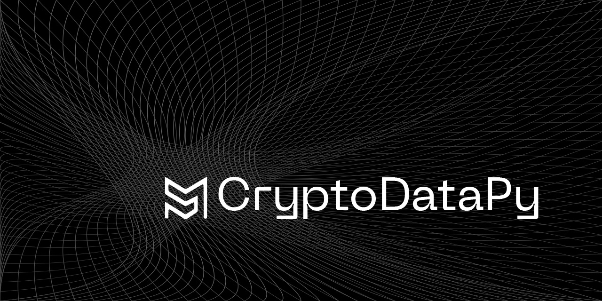

# CryptoDataPy
### _Better data beats fancier algorithms_
<br/>

CryptoDataPy is a python library which makes it easy to build high quality data pipelines 
for the analysis of digital assets.

Cryptoassets generate a huge amount of market, on-chain and off-chain data. 
But unlike legacy financial markets, this data is often fragmented, 
unstructured and dirty. By collecting data from various sources, 
processing it into a user-friendly format, assessing its quality, 
cleaning and repairing 'dirty data' and allowing for easy storage and retrieval,
CryptoDataPy allows you to spend less time gathering and cleaning data, 
and more time analyzing it.


Our library's intuitive interface facilitates each step of the ETL (extract-transform-load) process:

- Extracting data from a wide range of data sources and file formats.
- Wrangling data into a pandas DataFrame ready for data analysis and 
visualization, a.k.a [tidy data](https://www.jstatsoft.org/article/view/v059i10).
- Detecting, scrubbing and repairing 'dirty data', improving the accuracy 
of predictive models.
- Storing clean data and metadata for easy access and retrieval.

## Installation

```bash
$ pip install cryptodatapy
```

## Usage

`cryptodatapy` allows you to pull ready-to-analyze data from a variety of sources 
with only a few lines of code.

First specify which data you want with a data request:

```python
# import data request
from cryptodatapy.data_requests.datarequest import DataRequest
# specify parameters for data request: tickers, fields, start date, end_date, etc.
data_req = DataRequest(tickers=['btc', 'eth'], fields=['close', 'active_addresses'])
```
Then choose any supported data source to pull your data from:

```python
# import CryptoCompare
from cryptodatapy.data_vendors.cryptocompare import CryptoCompare
# initialize CryptoCompare
cc = CryptoCompare()
# pull data
cc.fetch_data(data_req)
```

With same data request parameters, can you retrieve the same data from another source:

```python
# import CoinMetrics
from.cryptodatapy.data_vendors.coinmetrics import CoinMetrics
# initialize CoinMetrics
cm = CoinMetrics()
# pull data
cm.fetch_data(data_req)
```

More detailed code examples and interactive tutorials for 
supported data sources are provided in cryptodatapy/docs/ 

## Supported Data Sources

- [CryptoCompare](https://min-api.cryptocompare.com/documentation)
- CoinGecko (v0.1.1)
- [Coin Metrics](https://docs.coinmetrics.io/api/v4/)
- Glassnode (v0.1.1)
- [investPy](https://investpy.readthedocs.io/)
- Tiingo (v0.1.1)

## Contributing

Interested in contributing? Check out the contributing guidelines and 
contact us at info@systamental.com. Please note that this project is 
released with a Code of Conduct. By contributing to this project, you agree 
to abide by its terms.

## License

`cryptodatapy` was created by Systamental. 
It is licensed under the terms of the Apache License 2.0 license.

